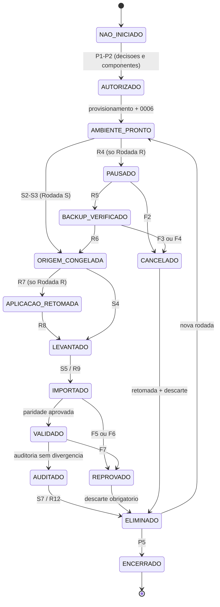
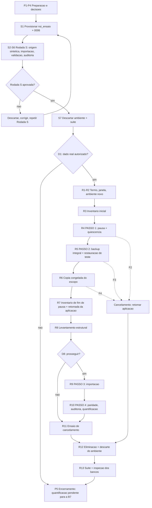
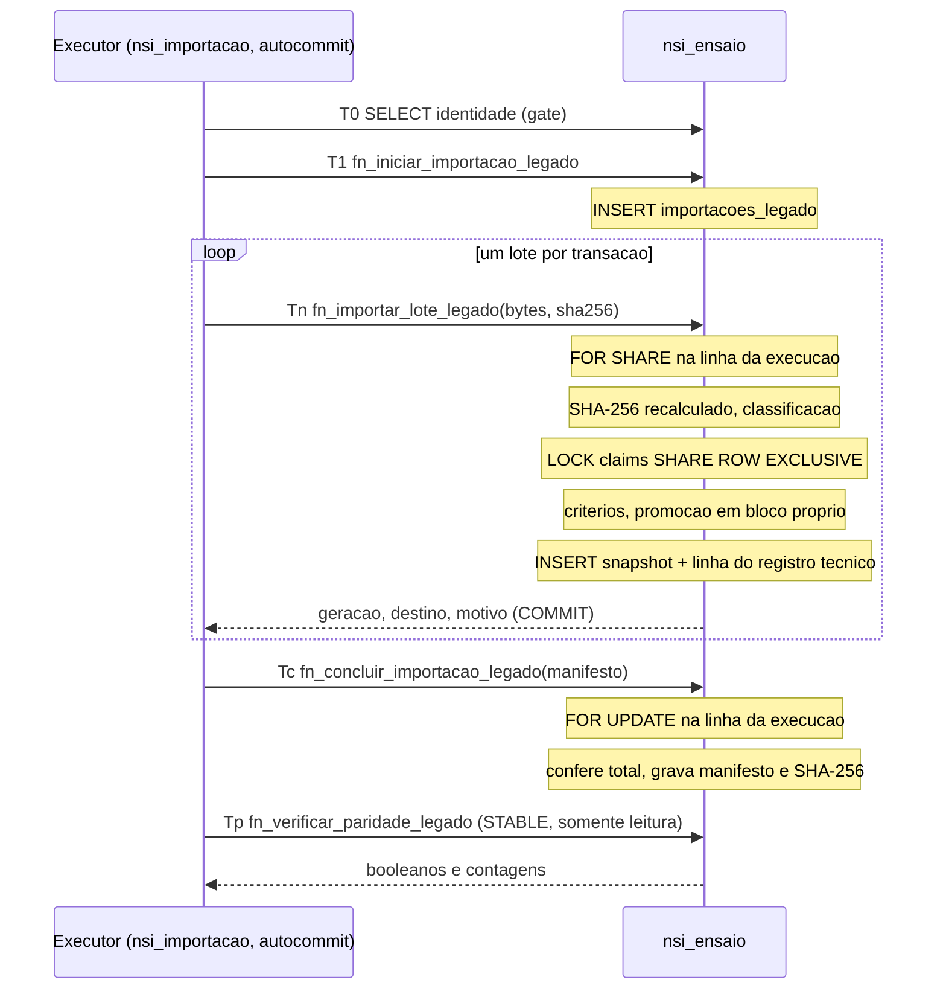

# Especificação Técnica e Operacional — Sprint B, Subetapa B6: Ensaio de Corte Controlado

**Natureza deste documento:** especificação técnica e operacional. **Não é uma ADR** — não fixa arquitetura nova e não redefine nada já congelado. Traduz, em procedimento concreto, o ensaio dos passos 1 a 4 do corte controlado.

**Subordinação:** integral à ADR-008 (Seções 16 e 17), à ADR-009, à ADR-010 e à `SPRINT-B-ESPECIFICACAO-TECNICA.md` (Seções 12, 14, 19 e 22), nessa ordem de precedência. Onde houver tensão, o documento superior prevalece e este é corrigido.

**Status:** PROPOSTA PARA REVISÃO — nenhuma implementação, provisionamento ou execução está autorizada por este documento. Cada subetapa (Seção 51) exige autorização própria.

**Local definitivo proposto:** `docs/implementation/SPRINT-B6-ESPECIFICACAO-ENSAIO-DE-CORTE.md`, a ser incluído no repositório somente após a aprovação.

**Convenções:** `D1`…`D10` são decisões humanas obrigatórias (Seção 49); `C1`…`C9` são componentes a implementar (Seção 17); `E1`…`E18` são evidências obrigatórias (Seção 36) e `O1`…`O5` opcionais (Seção 37); os passos da operação são numerados `P`, `S` e `R` (Seções 16 e 51). "Rodada S" é o ensaio com dados sintéticos; "Rodada R", com dado real.

**Leitura conjunta dos documentos de origem.** A releitura integral não encontrou conflito que impeça esta especificação. Três tensões de redação foram resolvidas pelas regras de precedência que os próprios documentos declaram, e ficam registradas para confirmação na revisão:

| Tensão | Resolução adotada |
|---|---|
| A Especificação (Seção 19) trata dado real no ensaio como exceção; a ADR-010 (Seções 12.3 e 24) atribui à B6 a quantificação dos lotes "sobre os dados reais" | A própria ADR-010 (Seção 21) submete o dado real da B6 às regras da Seção 19. A quantificação é o caso "estritamente necessário": só ocorre com autorização explícita (`D1`). Sem ela, a quantificação fica pendente e bloqueia a B7 (Seção 50) |
| O ROADMAP define a paridade como entre os `lote.json` e "o estado reconstruído via projeção corrente"; a ADR-010 (Seção 12) nunca promove lotes anteriores à A2, que não têm projeção | A ADR-010 (Seção 19) redefine a paridade: snapshot para todo lote aceito, projeção só para lote promovido. O ROADMAP declara-se subordinado às ADRs. Vale a ADR-010 |
| A ADR-008 (Seção 5) cita as "versões de correção" entre os dados em PostgreSQL; a ADR-009 (Seção 5) não cria histórico de valores no fluxo novo | Fora do alcance da B6. No legado, `historico_versoes` é preservado dentro de `documento_bruto` (B5.2, item 9). Registrado para a B7 |

---

## 1. Objetivo da B6

1. Ensaiar, em ambiente controlado, os passos 1 a 4 do corte da ADR-008 (Seção 16) — pausa de escritas, backup integral, importação e validação — sem executar o passo 5 e sem alterar a fonte de verdade.
2. Provar que o procedimento é executável de ponta a ponta, mensurável e cancelável sem dano.
3. Produzir a quantificação exigida pela ADR-010 (Seção 12.3): quantos lotes de cada geração existem e quantos estão em andamento.
4. Entregar à B7 o roteiro validado, as medidas de tempo e a lista do que ainda a bloqueia.

## 2. Escopo

- Ambiente de ensaio descartável: banco `nsi_ensaio`, seu migrator e a área de ensaio em disco (Seções 11 a 15).
- Extensão mínima dos artefatos da B5 para que rodem no ambiente de ensaio, sem relaxar nenhuma proteção em `test` (componentes `C1` a `C3`).
- Ferramentas do ensaio: inventário, cópia congelada, levantamento estrutural, auditoria e quantificação (componentes `C4` a `C7`).
- Rodada S, obrigatória; Rodada R, condicionada a `D1`.
- Ensaio do backup integral dos JSONs e do seu teste de restauração.
- Ensaio de cancelamento, eliminação auditada e relatório final.
- Testes unitários e de integração dos componentes novos, exclusivamente contra `nsi_test`.

## 3. Fora do escopo

- Passo 5 da ADR-008: mudança da fonte de verdade, troca do backend de `adapters/storage.py` e qualquer escrita em produção (B7).
- Definição do mecanismo de backup de produção, responsável, retenção, RPO, RTO e teste de restauração do PostgreSQL de produção (Seção 14 da Especificação — B7).
- Escolha da infraestrutura definitiva entre as opções A, B e C (Seção 12 da Especificação).
- Mecanismo de pausa de escritas dentro da aplicação (modo de manutenção). Na B6 a pausa é operacional (Seção 23).
- Qualquer alteração em migrations `0001`–`0006`, em tabelas, funções, triggers ou grants do schema, e em arquivo existente de `adapters/`, `core/payload_hash.py`, `app.py`, `integration/` e `services/`.
- Qualquer evento novo, qualquer mudança no catálogo da ADR-009 e qualquer mudança nas regras de classificação, preservação e promoção da B5.2.
- Importação em `nsi_dev` ou em `nsi_test` de dado real; leitura direta de `data/` pelo ensaio (ele lê somente a cópia congelada).
- Saída do Motor, logs de resposta, PDFs e CSVs: entram somente no backup integral, nunca na origem do ensaio.
- Política jurídica definitiva de retenção e expurgo (ADR-009, Seção 7; ADR-010, Seção 9.4).

## 4. Premissas

1. A B5 (B5.0 a B5.6) está concluída e publicada; `nsi_test` e `nsi_dev` estão em `0006 (head)`, com catálogos idênticos.
2. O servidor é o PostgreSQL 17 local, de uso exclusivo de desenvolvimento e teste, na porta 5432.
3. O volume legado é pequeno. A ADR-010 (Seção 3) registra, para o ambiente local, 5 lotes e 420 registros, todos anteriores à A1; o volume e as gerações do conjunto real a ensaiar só serão conhecidos na Rodada R.
4. O conteúdo de `data/` aparenta ser dado pessoal real (ADR-010, Seção 3) e é tratado como tal.
5. O operador é uma única pessoa, com acesso ao superusuário local e à instalação de origem.
6. As regras de classificação e promoção são as do banco (migration `0006`); nenhuma ferramenta da B6 as reimplementa para decidir destino.
7. A suíte de testes continua destrutiva em `nsi_test` (ciclos de downgrade) e nunca conecta a `nsi_ensaio`.

## 5. Dependências

1. ADR-008, ADR-009 e ADR-010 congeladas — satisfeita.
2. B5 publicada: commits `6eaabe1`, `54d1ab3`, `b0c7bc3`, `fa79510` — satisfeita.
3. Critério de aceite 1 da B5 (script de provisionamento da role executado duas vezes, Fase 3 aprovada) — **pendente, com o operador**.
4. Aprovação desta especificação e autorização da subetapa B6.2 (implementação).
5. Decisões `D1` a `D10` registradas (Seção 49).
6. Para a Rodada R: autorização da Seção 35 e atestado de fuso (`D3`).

## 6. Pré-requisitos

| # | Pré-requisito | Verificação |
|---|---|---|
| PR1 | Suíte completa aprovada em `nsi_test`, sem falhas e sem pulados | `NSI_REQUIRE_PG_TESTS=1 pytest` |
| PR2 | `nsi_test` e `nsi_dev` em `0006`, catálogos idênticos, nenhum objeto inválido | inspeção somente leitura |
| PR3 | Working tree limpa para arquivos versionados; `HEAD` = `origin/main` | `git status`, `git rev-list` |
| PR4 | Componentes `C1` a `C9` implementados, revisados e publicados | commit da B6.2 |
| PR5 | Área de ensaio criada fora do repositório e fora de `data/`, em volume com criptografia em repouso atestada (`D5`) | atestado do operador |
| PR6 | Servidor PostgreSQL sem registro de comandos nem de parâmetros em log (`log_statement = none`, `log_min_duration_statement = -1`, `log_parameter_max_length_on_error = 0` ou equivalente) | consulta a `pg_settings` |
| PR7 | Credencial do superusuário local disponível somente ao operador | — |
| PR8 | Espaço em disco suficiente para backup integral, cópia e banco (três vezes o tamanho de `data/`) | medição |

## 7. Critérios de entrada

**Para a B6.2 (implementação):** dependências 1 a 5 satisfeitas; PR1 a PR3.

**Para a Rodada S:** PR1 a PR8; `nsi_ensaio` provisionado e em `0006` (Seção 15).

**Para a Rodada R**, cumulativamente:
1. Rodada S aprovada (Seção 9) e `nsi_ensaio` da Rodada S já descartado.
2. `D1` = sim, com o termo de autorização da Seção 35 assinado.
3. `D2`, `D3`, `D4`, `D6` e `D7` registradas.
4. `nsi_ensaio` provisionado de novo, vazio, em `0006`.

## 8. Critérios de saída

A B6 encerra quando, cumulativamente:
1. A Rodada S foi executada e aprovada.
2. A Rodada R foi executada e teve seu resultado registrado (aprovada, aprovada com achados ou reprovada), **ou** foi formalmente dispensada por `D1` = não.
3. Todas as evidências obrigatórias aplicáveis foram coletadas (Seção 36).
4. Todo dado real foi eliminado do ambiente de ensaio, com registro (Seção 32).
5. `nsi_ensaio` e seu migrator não existem mais; as concessões temporárias foram revogadas.
6. A suíte completa passa em `nsi_test`, e `nsi_dev`/`nsi_test` continuam em `0006`, com catálogos idênticos.
7. O relatório final e a documentação de encerramento foram registrados (Seções 41 e 55).

## 9. Critérios de sucesso

**Rodada S — aprovada quando:**
- todo arquivo do escopo aparece no manifesto com destino explícito;
- a paridade é aprovada (banco, origem e manifesto completo);
- os destinos obtidos são exatamente os esperados para a origem sintética, que precisa conter as quatro gerações, cada motivo de recusa e pelo menos uma promoção `a2` e uma `a3`;
- a auditoria da Seção 28 não encontra divergência;
- o descarte do banco é comprovado.

**Rodada R — aprovada quando:**
- a prova de quiescência da pausa é válida (Seção 23);
- o backup integral é restaurável e confere (Seção 22);
- a cópia congelada confere com o inventário da origem (Seção 24);
- todo arquivo do escopo aparece no manifesto com destino explícito;
- a paridade é aprovada;
- a quantificação é produzida (Seção 28);
- a instalação de origem está comprovadamente intacta (Seção 29);
- a eliminação é comprovada (Seção 32).

**Aprovada com achados:** todos os itens acima, mais pelo menos um lote real com destino `recusado`. A recusa é comportamento correto do sistema, mas o lote recusado não é preservado; por isso cada recusa real vira achado a decidir antes da B7 (Seção 50).

**B6 concluída com sucesso:** critérios de saída da Seção 8 atendidos, com a Rodada S aprovada e a Rodada R aprovada, aprovada com achados ou dispensada.

## 10. Critérios de falha

| Código | Condição | Efeito |
|---|---|---|
| F1 | Gate de identidade recusa o ambiente | execução não inicia |
| F2 | Prova de quiescência inválida (a origem mudou durante a pausa) | Rodada R cancelada; nova janela |
| F3 | Backup não confere ou não é restaurável | Rodada R cancelada antes da cópia |
| F4 | Cópia congelada diverge do inventário | Rodada R cancelada |
| F5 | Executor aborta (`arquivo_alterado_durante_a_execucao` ou erro inesperado) | rodada reprovada; banco descartado |
| F6 | Paridade reprovada (banco, origem ou manifesto) | rodada reprovada |
| F7 | Auditoria encontra evento, recibo ou claim atribuível à importação, ou valor pessoal em evidência | rodada reprovada; investigação obrigatória |
| F8 | Instalação de origem alterada pelo ensaio | **falha grave**: B6 suspensa até análise |
| F9 | Eliminação não comprovada dentro do prazo de `D6` | B6 não encerra; incidente registrado |
| F10 | Suíte de testes falha por causa do ambiente de ensaio | B6.2 reaberta |

Toda falha é registrada no relatório (Seção 55). Nenhuma falha autoriza correção silenciosa de dado, de manifesto ou de regra.

## 11. Arquitetura do ambiente de ensaio

Três zonas, com fluxo de dados em um único sentido:

| Zona | Conteúdo | Quem escreve | Quem lê |
|---|---|---|---|
| **Instalação de origem** | a aplicação legada e seu diretório de dados (`D2`) | somente a aplicação legada | operador (inventário, backup, cópia) |
| **Área de ensaio** (disco, fora do repositório e de `data/`) | `backup/`, `origem/` (cópia congelada do escopo), `evidencias/`, `restauracao/` (temporário) | operador e ferramentas `C4`–`C6` | executor (`origem/`) |
| **Banco de ensaio** (`nsi_ensaio`) | schema `nsi_operacional` em `0006` | as quatro funções de importação | auditoria somente leitura (`C7`) |

Regras de fronteira:
- O ensaio **nunca abre a instalação de origem para escrita** e o executor nunca a lê: ele lê somente `origem/` da área de ensaio.
- A área de ensaio tem estrutura fixa: `<area>/<ensaio_id>/{backup,origem,evidencias,restauracao}`, com um `ensaio_id` por rodada.
- `evidencias/` não contém dado pessoal e é a única pasta que sobrevive à eliminação.
- Nenhum componente do ensaio conecta a `nsi_dev`. A suíte de testes nunca conecta a `nsi_ensaio`.

## 12. Justificativa técnica para NÃO utilizar `nsi_test`

1. **A suíte destrói o conteúdo.** Os testes de ciclo executam `downgrade` até `base`, `0001`, `0002`, `0003`, `0004` e `0005` em `nsi_test`. O snapshot, o registro técnico e a projeção do ensaio seriam apagados na execução seguinte da suíte.
2. **A promoção quebraria a suíte para sempre.** O downgrade da `0006` aborta se existir linha com destino `promovido`, e o registro técnico é imutável inclusive para o owner. Um único lote promovido confirmado em `nsi_test` faria todo teste de ciclo falhar, sem conserto dentro das regras.
3. **A suíte afirma o contrário.** `test_nsi_test_nao_tem_nenhum_lote_promovido_confirmado` exige zero promoções confirmadas; a B5.2 (item 17) proíbe commit de promoção em teste.
4. **Dado real não pode viver num banco de teste.** `nsi_test` recebe resíduo sintético de dezenas de testes, é acessado por todas as credenciais de teste e não tem controle de retenção nem eliminação auditada (Especificação, Seção 19).
5. **A quantificação ficaria contaminada** pelo resíduo sintético dos testes com commit real.

## 13. Justificativa técnica para utilizar um banco descartável

1. **A promoção é irreversível dentro do banco em que ocorre.** A única forma limpa de desfazer um ensaio com promoção é remover o banco inteiro.
2. **O registro técnico é imutável.** Não existe "limpar" um ensaio: só descartar.
3. **Eliminação auditável.** Remover o banco elimina de uma vez o snapshot (que contém dado pessoal), sem `DELETE` seletivo e sem desabilitar trigger.
4. **Estado inicial conhecido.** Cada rodada parte de um banco vazio em `0006`, o que torna a quantificação e a paridade inequívocas.
5. **Isolamento de credenciais.** `nsi_importacao` recebe `CONNECT` no banco de ensaio somente durante a janela (ADR-010, Seção 16.2) e o perde no descarte.
6. **Nenhum downgrade é necessário**, preservando a regra de que downgrade só ocorre em `nsi_test`.

Alternativa rejeitada: instância PostgreSQL dedicada (outra porta, outro diretório de dados). Isolaria também os catálogos compartilhados, mas exigiria reprovisionar todas as roles, mudar o gate de porta e administrar um segundo serviço — custo desproporcional a um ensaio local com volume mínimo. Fica registrada como opção para a B7 (Seção 12 da Especificação).

## 14. Especificação completa do banco de ensaio

| Atributo | Valor |
|---|---|
| Nome | `nsi_ensaio` |
| Servidor | o mesmo cluster PostgreSQL 17 local, porta 5432 (Opção B da Seção 12 da Especificação, **somente para o ensaio**) |
| Codificação | `UTF8`, mesmas `LC_COLLATE`/`LC_CTYPE` de `nsi_test` (as funções leem documentos com `convert_from(..., 'UTF8')`) |
| Dono do banco | o superusuário local |
| Schema | `nsi_operacional`, dono `nsi_eventos_owner` |
| Revisão | `0006`, aplicada somente por `upgrade`; **nunca `downgrade`** |
| Ciclo de vida | criado por rodada, descartado por `DROP DATABASE` ao fim dela |
| Isolamento exigido | `READ COMMITTED` (contrato da `0005` e da `0006`) |

**Roles e privilégios:**

| Role | Em `nsi_ensaio` |
|---|---|
| `nsi_ensaio_migrator` (**nova**, `LOGIN NOSUPERUSER NOCREATEDB NOCREATEROLE NOREPLICATION NOBYPASSRLS`) | `CONNECT` somente em `nsi_ensaio`; `USAGE` no schema; membership em `nsi_eventos_owner` com `INHERIT FALSE, SET TRUE, ADMIN FALSE`, igual à dos outros migrators; dona de `alembic_version` |
| `nsi_importacao` | `CONNECT` e `USAGE` no schema, **somente durante a janela do ensaio**; `EXECUTE` nas quatro funções, concedido pela própria `0006` |
| `nsi_eventos_owner` | dono das tabelas e funções, como em todo banco |
| `nsi_aplicacao`, `nsi_expiracao`, `nsi_operador_restrito`, `nsi_congelamento` | **sem `CONNECT`** em `nsi_ensaio` — o ensaio não exercita o fluxo novo |
| `nsi_dev_migrator`, `nsi_test_migrator` | sem `CONNECT` em `nsi_ensaio` |
| `PUBLIC` | sem `CONNECT` |

A membership do novo migrator em `nsi_eventos_owner` é do mesmo tipo já aprovado na B3.1 para os migrators e **não é exceção** à regra de membership das roles funcionais (ADR-009, Seção 21).

**Conteúdo esperado ao fim de uma rodada:** 13 tabelas, 21 funções, 29 índices, 97 constraints e 6 triggers, idênticos aos de `nsi_test`; dados somente nas cinco tabelas da `0006` e, se houver promoção, em `lotes` e `registros_coleta`; zero linhas em `eventos_lote`, `eventos_registro_coleta`, `eventos_claim`, `claims` e `comandos_idempotentes`.

## 15. Provisionamento do ambiente

Script administrativo `scripts/postgres_local/provisionar_b6_ensaio.sql` (componente `C2`), no padrão de três fases da B3.1, da B4.3 e da B5.3, executado pelo operador com o superusuário:

- **Fase 1 — preflight somente leitura (`READ ONLY`).** Confirma a identidade do servidor; as oito roles existentes com os atributos aprovados; `nsi_dev` e `nsi_test` em `0006`; e um de dois estados previstos: ambiente ausente (nenhum `nsi_ensaio`, nenhum `nsi_ensaio_migrator`) ou ambiente já provisionado exatamente como a Seção 14. Qualquer outro estado aborta sem escrita.
- **Fase 2 — convergência.** Cria `nsi_ensaio_migrator` (sem senha no script), o banco `nsi_ensaio`, o schema; aplica `REVOKE CONNECT ... FROM PUBLIC`; concede `CONNECT` e `USAGE` ao migrator e a `nsi_importacao`; concede a membership do migrator. Cada ação confirma, por leitura, o estado do objeto antes de alterá-lo.
- **Fase 3 — pós-validação somente leitura.** Revalida tudo a partir do zero.

Depois do script, o operador: (1) define a senha do migrator com `\password`; (2) configura `ENSAIO_DATABASE_URL` e `ENSAIO_DATABASE_URL_NSI_IMPORTACAO` no `.env` local; (3) executa `NSI_DATABASE_ENV=ensaio alembic upgrade 0006`; (4) confere o catálogo contra `nsi_test`.

**Reversão:** `scripts/postgres_local/desprovisionar_b6_ensaio.sql`, também em fases, com confirmação textual exata: revoga `CONNECT`/`USAGE` de `nsi_importacao`, executa `DROP DATABASE nsi_ensaio`, remove a membership e `DROP ROLE nsi_ensaio_migrator`, e revalida. É o mecanismo de descarte da Seção 34 e, ao contrário das reversões da B3 a B5, **é executado** em toda rodada.

**Efeito sobre artefatos existentes** (limitações aceitas, no mesmo padrão da B5.2, item 4):
- os scripts de provisionamento da B3.1, B4.3 e B5.3 não são reexecutáveis enquanto `nsi_ensaio` existir, porque suas Fases 1 e 3 só conhecem `nsi_dev` e `nsi_test`. Eles não são alterados;
- os testes somente leitura de provisionamento, que consultam catálogos compartilhados do cluster, passam a aceitar **um único estado adicional**: a existência de `nsi_ensaio` com exatamente as concessões da Seção 14 (componente `C9`). A suíte precisa passar com e sem o ambiente de ensaio presente.

## 16. Fluxo completo do operador

Numeração usada em todo o documento. Cada passo gera a evidência indicada.

**Preparação**
- `P1` Aprovar esta especificação e registrar `D1` a `D10`.
- `P2` Autorizar a B6.2; receber os componentes publicados, com a suíte aprovada (`E1`).
- `P3` Criar a área de ensaio e atestar a criptografia do volume (`D5`).
- `P4` Conferir PR1 a PR8.

**Rodada S**
- `S1` Provisionar o ambiente (Seção 15) e aplicar a `0006` (`E2`).
- `S2` Gerar a origem sintética na área de ensaio (`C8`).
- `S3` Executar inventário, backup, restauração de teste e cópia congelada sobre a origem sintética (ensaio das Seções 22 a 24, sem aplicação real).
- `S4` Executar o levantamento estrutural (`E7`).
- `S5` Executar a importação com um fuso declarado (`E8`).
- `S6` Executar a validação e a auditoria (`E9` a `E12`).
- `S7` Descartar o ambiente (`E16`) e conferir a suíte (`E17`).
- `S8` Registrar o resultado da Rodada S.

**Rodada R** — somente com `D1` = sim
- `R1` Assinar o termo de autorização (Seção 35) e confirmar a janela (`D4`).
- `R2` Provisionar o ambiente de novo, vazio, e aplicar a `0006` (`E2`).
- `R3` Inventário inicial da instalação de origem, com a aplicação ainda em operação (`E3`).
- `R4` **Passo 1 — pausar a aplicação** e provar a quiescência (`E4`).
- `R5` **Passo 2 — backup integral** e teste de restauração (`E5`).
- `R6` Cópia congelada do escopo para `origem/` e conferência (`E6`).
- `R7` Inventário de fim de pausa e **retomada da aplicação** (`E4`, `E13`).
- `R8` Levantamento estrutural da cópia (`E7`) e decisão `D8` de prosseguir.
- `R9` **Passo 3 — importação**, com o fuso de `D3` ou sem fuso (`E8`).
- `R10` **Passo 4 — validação**: paridade, auditoria e quantificação (`E9` a `E12`).
- `R11` Ensaio de cancelamento (`E13`).
- `R12` Eliminação do dado real e descarte do ambiente (`E14` a `E16`).
- `R13` Suíte completa e inspeção final dos bancos (`E17`).

**Encerramento**
- `P5` Relatório final e documentação de encerramento (`E18`).

## 17. Fluxo completo do sistema

Componentes a implementar na B6.2. Os nomes são candidatos, a fixar na implementação.

| # | Componente | Natureza | Função |
|---|---|---|---|
| `C1` | `config.py` — ambiente `ensaio` | alteração | terceiro valor fechado de `NSI_DATABASE_ENV`; variáveis `ENSAIO_DATABASE_URL` e `ENSAIO_DATABASE_URL_NSI_IMPORTACAO`; banco exigido exato `nsi_ensaio`; mesmas proteções (sem fallback, usuário exato, sem credencial em exceção) |
| `C2` | `provisionar_b6_ensaio.sql`, `desprovisionar_b6_ensaio.sql` | novos | Seção 15 |
| `C3` | `scripts/importar_legado.py` — gate por ambiente | alteração | aceita `test` → `nsi_test` e `ensaio` → `nsi_ensaio`; em `ensaio`, exige origem dentro da área de ensaio; em qualquer ambiente, recusa origem igual a **ou contida em** o diretório de dados da aplicação |
| `C4` | inventário de diretório | novo, puro | SHA-256 e tamanho por arquivo do escopo; para o restante, somente contagem, bytes e um resumo agregado — **nunca nomes de arquivo fora do escopo** |
| `C5` | cópia congelada | novo | copia somente os arquivos do escopo para `origem/`, marca somente leitura e confere contra o inventário |
| `C6` | levantamento estrutural | novo, puro | por arquivo de lote: legibilidade, chaves de raiz e de registro, tipos — **nunca valores**; compara com as listas do item 6.2 da B5.2 |
| `C7` | `auditoria_b6_ensaio.sql` | novo, somente leitura | consultas da Seção 28, executadas pelo migrator de ensaio sob `SET LOCAL ROLE nsi_eventos_owner`, em transação `READ ONLY` |
| `C8` | gerador de origem sintética | novo | árvore representativa das quatro gerações e dos formatos de recusa (`D10`), com valores marcados como sintéticos |
| `C9` | testes | novos e ajustes | unitários de `C1`, `C3` a `C6` e `C8`; estáticos de `C2` e `C7`; ajuste dos testes de provisionamento (Seção 15). Nenhum teste conecta a `nsi_ensaio` |

**Sequência do sistema numa rodada:**
1. Gate de identidade do executor: banco e ambiente coerentes, servidor local, porta 5432, `session_user = nsi_importacao`.
2. Validação da origem: dentro da área de ensaio, fora do diretório de dados.
3. Enumeração do escopo, com tamanho e SHA-256.
4. `fn_iniciar_importacao_legado`.
5. Um `fn_importar_lote_legado` por lote, uma transação por lote.
6. Manifesto canônico; `fn_concluir_importacao_legado`.
7. `fn_verificar_paridade_legado`; conferência da origem contra o manifesto.
8. Relatório do executor, sem valor pessoal.
9. Auditoria `C7` e quantificação.

Nenhuma dessas etapas altera função, tabela ou regra da `0006`.

## 18. Máquina de estados

Regras: (1) não há transição de volta a partir de `IMPORTADO` — um banco importado só segue para validação ou descarte; (2) todo caminho passa por `ELIMINADO` antes de `ENCERRADO`; (3) `CANCELADO` na Rodada R exige a retomada da aplicação antes de qualquer outra ação; (4) a Rodada R só parte de `AMBIENTE_PRONTO` depois de a Rodada S ter chegado a `ELIMINADO` com resultado aprovado.

## 19. Diagrama completo da operação

## 20. Diagrama das transações

Uma transação por chamada. Bloqueios na ordem em que são adquiridos:

Propriedades relevantes para o ensaio:
- a falha de um lote desfaz somente a transação daquele lote; os anteriores permanecem confirmados e a execução fica aberta;
- a conclusão espera qualquer importação em andamento e nenhuma importação grava depois dela;
- o bloqueio de `claims` não tem efeito prático no ensaio, porque nenhuma role do fluxo novo conecta a `nsi_ensaio`;
- a auditoria `C7` roda em transações `READ ONLY` separadas e não participa desse diagrama.

## 21. Diagrama do banco

```mermaid
erDiagram
    importacoes_legado ||--o{ importacoes_legado_arquivos : "uma linha por lote apresentado"
    importacoes_legado ||--o| importacoes_legado_conclusoes : "manifesto"
    importacoes_legado ||--o{ lotes_legado : "snapshot"
    lotes_legado ||--o{ registros_legado : "um por registro"
    lotes_legado }o--o| lotes : "lote_id_promovido"
    lotes ||--o{ registros_coleta : "projecao"
    importacoes_legado {
        uuid importacao_id PK
        timestamptz iniciada_em
        text executado_por_login
        text fuso_declarado
    }
    importacoes_legado_arquivos {
        uuid importacao_id FK
        text caminho_relativo
        text documento_sha256
        text geracao
        text destino
        text motivo
        uuid lote_id_promovido
    }
    importacoes_legado_conclusoes {
        uuid importacao_id PK
        bytea manifesto_canonico
        text manifesto_sha256
        int total_arquivos
    }
    lotes_legado {
        uuid snapshot_lote_id PK
        text lote_id_legado UK
        bytea documento_bruto
        text documento_sha256
        jsonb status_legado
        text destino
    }
    registros_legado {
        uuid snapshot_lote_id FK
        text lista
        int posicao
        jsonb conteudo_bruto
        uuid registro_coleta_id
        text classificacao
    }
```

Registro técnico (três primeiras tabelas): sem valor pessoal, imutável inclusive para o owner. Snapshot (`lotes_legado`, `registros_legado`): contém dado pessoal, sem trigger de imutabilidade. As demais tabelas do schema (`claims`, `eventos_*`, `comandos_idempotentes`) existem em `nsi_ensaio` e precisam terminar a rodada vazias.

## 22. Fluxo do backup

Passo 2 da ADR-008 (Seção 16): backup integral dos dados existentes, **antes** da importação.

1. Pré-condição: aplicação pausada e quiescência provada (Seção 23).
2. O operador gera um arquivo único com **todo** o diretório de dados da instalação de origem — inclusive o que está fora do escopo da importação (respostas, PDFs, CSVs, saída do Motor) —, gravado em `backup/` da área de ensaio.
3. Registra tamanho e SHA-256 do arquivo de backup.
4. **Teste de restauração:** extrai o backup em `restauracao/` e executa o inventário `C4` sobre o resultado. O resumo agregado e os SHA-256 por arquivo do escopo precisam ser idênticos aos do inventário de quiescência.
5. Apaga `restauracao/`.
6. Evidência `E5`: tamanho, SHA-256 do backup, resultado da comparação e duração de cada etapa.

Regras:
- a ferramenta de arquivamento é a nativa do sistema operacional; nenhuma ferramenta de backup de produção é escolhida aqui (isso é da Seção 14 da Especificação);
- o backup contém todo o dado pessoal da instalação; fica somente na área de ensaio, protegido como a cópia, e tem o destino definido por `D7`;
- reprovação em qualquer etapa é `F3` e cancela a rodada antes da cópia;
- este ensaio **não** satisfaz a Seção 14 da Especificação: prova que o procedimento de backup dos JSONs funciona e mede seu tempo; não define o backup de produção.

## 23. Fluxo da pausa da aplicação

Passo 1 da ADR-008 (Seção 16). Na B6 a pausa é **operacional**: a aplicação legada não tem modo de manutenção, e esta especificação não cria um.

1. `R3` — inventário inicial `I0` da instalação de origem, com a aplicação em operação.
2. `R4` — o operador encerra todos os processos que escrevem no diretório de dados: o servidor da aplicação (`app.py`), qualquer agendador que chame `core/scheduler.py` e o receptor de webhook.
3. Confirma que nenhum processo da aplicação está em execução e que a porta do serviço não está em escuta.
4. Inventário `I1` logo após a parada.
5. **Janela de observação** de pelo menos 2 minutos, sem nenhuma ação sobre a origem.
6. Inventário `I2`. **Prova de quiescência:** `I1` = `I2`, arquivo a arquivo no escopo e no resumo agregado do restante.
7. Backup (Seção 22) e cópia (Seção 24).
8. `R7` — inventário `I3` imediatamente antes da retomada. `I3` = `I1` prova que **nada mudou na origem durante toda a pausa**, inclusive por ação do ensaio.
9. Retomada da aplicação (Seção 31).

Regras:
- escritas que chegam durante a pausa (por exemplo, webhooks da Meta) não são recebidas; o impacto e a duração máxima são aceitos em `D4`;
- `I1` ≠ `I2` é `F2`: algum escritor não foi parado. A rodada é cancelada e a aplicação retomada;
- `I3` ≠ `I1` é `F8`;
- na Rodada S não há aplicação: os passos 4 a 6 e 8 são executados sobre a origem sintética, para ensaiar a ferramenta e medir o tempo;
- a duração total da pausa é medida (`E4`) e é o principal insumo para a janela da B7. Na B7 a pausa vai até o passo 5; na B6, termina depois da cópia, porque o ensaio continua sobre a cópia congelada.

## 24. Fluxo da cópia dos JSONs

1. Pré-condição: backup verificado.
2. `C5` copia, da instalação de origem para `origem/` da área de ensaio, **somente** os arquivos do escopo da B5.2 (item 6.1): `lotes/<diretorio>/lote.json` e `correcoes_rejeitadas/<AAAA-MM-DD>/<uuid>.json`. Nada mais é copiado (minimização — Especificação, Seção 19).
3. A cópia preserva os bytes exatos e a estrutura de diretórios; nenhuma conversão de codificação ou de fim de linha.
4. `origem/` é marcada somente leitura.
5. Conferência: o inventário de `origem/` tem exatamente os arquivos do escopo de `I1`, com os mesmos tamanhos e SHA-256. Divergência é `F4`.
6. Evidência `E6`: quantidade de arquivos por tipo, bytes totais, resultado da conferência, duração.

A partir daqui a instalação de origem não é mais lida pelo ensaio, exceto pelo inventário `I3`.

## 25. Fluxo da importação

Passo 3 da ADR-008 (Seção 16), executado pelo executor publicado na B5.5, com o gate de `C3`.

1. Comando: `NSI_DATABASE_ENV=ensaio python scripts/importar_legado.py --origem <area>/<ensaio_id>/origem [--fuso <IANA>]`.
2. `--fuso` é o valor de `D3`. Se o operador não puder atestar um fuso único, o parâmetro é omitido: todos os lotes são processados, nenhum é promovido e o relatório registra `fuso_nao_declarado` (ADR-010, Seção 13.3).
3. O `importacao_id` é gerado pelo executor e anotado na evidência `E8`.
4. Saída 0: paridade aprovada. Saída 1: execução concluída com paridade reprovada (`F6`). Saída 2: recusada ou abortada (`F1` ou `F5`).
5. Em caso de aborto, a execução fica aberta no banco. **Não se retoma**: o banco é descartado e a rodada recomeça de um ambiente novo — a retomada da B5.5 existe, mas num ensaio o estado inicial conhecido vale mais que o reaproveitamento.
6. O relatório do executor (JSON, sem valor pessoal) é gravado em `evidencias/`.

Nenhuma regra de classificação, preservação ou promoção é alterada ou reinterpretada: valem os itens 5 a 13 da B5.2.

## 26. Fluxo da validação

Passo 4 da ADR-008 (Seção 16): confirmar integridade e completude. A validação é a soma de quatro verificações, todas obrigatórias:

| # | Verificação | Fonte | Aprovada quando |
|---|---|---|---|
| V1 | Paridade do banco | `fn_verificar_paridade_legado` | `aprovada = true` |
| V2 | Paridade da origem | executor | `origem_confere` e `manifesto_completo` verdadeiros |
| V3 | Auditoria do banco | `C7` (Seção 28) | nenhuma divergência |
| V4 | Regressão | suíte completa em `nsi_test` | 100% aprovada, sem pulados |

Na Rodada S soma-se a **V5**: os destinos e motivos obtidos são exatamente os esperados para a origem sintética, declarados antes da execução.

A validação é **aprovada** somente com todas as verificações aprovadas. Não existe aprovação parcial nem dispensa de verificação.

## 27. Fluxo da paridade

Definição da ADR-010 (Seção 19) e do item 14 da B5.2, sem alteração:

1. **Snapshot** — para todo lote aceito: SHA-256 de `documento_bruto` igual ao registrado; quantidade de registros igual à do documento; `conteudo_bruto` e `conteudo_sha256` de cada registro iguais aos recalculados.
2. **Projeção** — para todo lote promovido: cada valor de `registros_coleta` igual ao mapeamento recalculado; totais iguais à recontagem; `recebido_em` igual à reinterpretação de `criado_em_bruto` no fuso gravado; nenhum evento atribuído a `nsi_importacao`; prova de origem.
3. **Registro técnico e manifesto, nos dois sentidos** — SHA-256 do manifesto; cabeçalho igual à execução; cada linha igual à entrada correspondente; toda entrada de lote com linha.
4. **Origem** — SHA-256 atual de cada arquivo de `origem/` igual ao do manifesto; todo arquivo enumerado no manifesto, com destino explícito.

No ensaio nenhum lote pode aparecer como "evoluído no fluxo novo": o fluxo novo não roda em `nsi_ensaio`. `evoluidos_no_fluxo_novo` diferente de zero é divergência (`F7`).

## 28. Fluxo da auditoria

Executada depois da paridade, por `C7`, em transações `READ ONLY`. Saída somente com contagens, enums, identificadores e booleanos.

**A. Integridade estrutural**
- revisão `0006`; catálogo idêntico ao de `nsi_test` (tabelas, funções com owner, `SECURITY DEFINER` e `search_path`, índices, constraints, triggers);
- nenhum índice inválido, constraint não validada ou trigger desabilitada;
- concessões exatamente as da Seção 14.

**B. Invariantes da importação**
- zero linhas em `eventos_lote`, `eventos_registro_coleta`, `eventos_claim`, `claims` e `comandos_idempotentes`;
- `executado_por_login = nsi_importacao` em toda execução; `fuso_declarado` igual a `D3`;
- uma única execução, concluída; `total_arquivos` igual às linhas registradas;
- nenhum registro `legado_sem_identidade_tecnica` com UUID e nenhum registro identificado sem UUID;
- nenhum lote de geração `anterior_a1` ou `a1` com destino `promovido`;
- para todo lote promovido: `status = aguardando_d8`, `versao_eventos_atual = 1`, registros com `versao_eventos_atual = 0`.

**C. Quantificação (ADR-010, Seção 12.3)**
- lotes por geração e destino; por motivo de não promoção; por motivo de recusa;
- registros por classificação;
- por geração: distribuição do valor **literal** de `status` do documento (o status legado nunca é convertido — ADR-010, Seção 14);
- **lotes em andamento:** lotes preservados ou promovidos cujo documento não apresenta nenhuma das evidências de disparo do item 6.3 da B5.2, por geração. É a contagem dos lotes que, se anteriores à A2, **não continuam** no sistema novo e exigem novo upload depois do corte;
- menor e maior `criado_em` bruto, como texto, sem interpretação.

**D. Privacidade**
- varredura das evidências produzidas (relatórios, saídas da auditoria, logs do terminal salvos) contra uma lista de valores pessoais amostrados **em memória** a partir do snapshot, nunca gravada em disco.

Qualquer divergência em A, B ou D é `F7`. A parte C nunca reprova: é o resultado que a B6 existe para produzir.

## 29. Fluxo do cancelamento

A ADR-008 (Seção 16) exige que, falhando a importação ou a validação, o corte seja cancelado por inteiro e o sistema continue operando com os JSONs originais. A B6 ensaia esse cancelamento **em toda rodada**, aprovada ou não (`R11`):

1. Provar que a instalação de origem estava intacta ao fim da pausa: `I3` = `I1` (Seção 23).
2. Confirmar que a aplicação voltou a operar normalmente sobre os JSONs originais: processo em execução, serviço respondendo, e uma leitura funcional (listar lotes) sem erro.
3. Confirmar que nenhum componente do ensaio possui caminho de escrita para a instalação de origem: `origem/` é uma cópia, somente leitura, em outra área.
4. Declarar o banco de ensaio sem valor operacional e encaminhá-lo ao descarte.
5. Evidência `E13`.

Cancelamento antecipado (falhas `F2`, `F3`, `F4`): a aplicação é retomada imediatamente, antes de qualquer análise; depois, eliminação e descarte.

## 30. Fluxo do rollback

| Ponto | O que existe | Como se desfaz |
|---|---|---|
| RB1 — antes da pausa | ambiente provisionado, vazio | `desprovisionar_b6_ensaio.sql` |
| RB2 — durante a pausa | aplicação parada | retomar a aplicação (Seção 31) |
| RB3 — depois do backup e da cópia | `backup/` e `origem/` | apagar a área de ensaio (Seção 32) |
| RB4 — depois da importação | banco com snapshot, registro técnico e, talvez, promoções | **somente** `DROP DATABASE` — nunca `downgrade`, nunca `DELETE`, nunca desabilitar trigger |
| RB5 — depois do descarte | nada | — |

Regras:
- não existe rollback parcial de uma rodada importada;
- nenhum rollback do ensaio toca `nsi_test`, `nsi_dev` ou a instalação de origem;
- o rollback da B6.2 (código) é reversão por commit, com a suíte aprovada antes e depois.

## 31. Fluxo da retomada

**Retomada da aplicação** (`R7`):
1. Inventário `I3` e comparação com `I1`.
2. Iniciar a aplicação com a mesma configuração de antes da pausa.
3. Confirmar que o serviço responde e que a listagem de lotes funciona.
4. Registrar o instante da retomada; duração da pausa = retomada − parada.

**Retomada de uma rodada interrompida:** não há. Uma rodada interrompida em qualquer ponto depois de `AMBIENTE_PRONTO` segue para eliminação e descarte, e uma rodada nova começa de um ambiente novo (Seção 25, passo 5).

**Retomada depois de falha de infraestrutura** (queda de energia, do servidor ou do terminal): primeiro verificar se a aplicação precisa ser retomada; depois tratar a rodada como interrompida.

## 32. Fluxo da eliminação dos dados

Executado ao fim de toda rodada, na ordem:

1. Conferir que as evidências sem dado pessoal estão completas em `evidencias/` e copiá-las para fora da área de ensaio.
2. Banco: `desprovisionar_b6_ensaio.sql` (Seção 15) — revoga concessões, `DROP DATABASE nsi_ensaio`, `DROP ROLE nsi_ensaio_migrator`.
3. Forçar a reciclagem dos segmentos de WAL (`CHECKPOINT` e troca de segmento), para reduzir o resíduo do snapshot no log de transações.
4. Área de ensaio: apagar `origem/`, `restauracao/` e, conforme `D7`, `backup/`.
5. Remover do `.env` local as variáveis `ENSAIO_DATABASE_URL*`.
6. Limpar o histórico do terminal e arquivos temporários usados na rodada.
7. **Verificação:** `nsi_ensaio` e `nsi_ensaio_migrator` inexistentes; `nsi_importacao` com `CONNECT` somente em `nsi_test`; área de ensaio contendo somente `evidencias/`.
8. Evidência `E14` a `E16`: data, hora, itens eliminados, resultado da verificação.

Limite técnico declarado: apagar arquivos e remover o banco não sobrescreve os blocos no disco. A proteção contra recuperação posterior é a criptografia em repouso do volume (`PR5`); sem ela, a Rodada R não ocorre.

## 33. Política de retenção

| Item | Retenção |
|---|---|
| Dado real em `origem/` e no banco de ensaio | o mínimo necessário: até o encerramento da validação e da auditoria, limitado ao prazo de `D6` (recomendado: 72 horas; teto: 7 dias corridos) |
| Backup integral produzido no ensaio | `D7`: eliminado junto com o ensaio (recomendado) ou retido pelo operador sob política própria, fora da B6 |
| Dados sintéticos | sem restrição; eliminados com o ambiente |
| Evidências sem dado pessoal | permanentes, junto à documentação do projeto |
| Variáveis e credenciais do ambiente de ensaio | até o descarte do ambiente |

O prazo de `D6` conta a partir da cópia (`R6`). Atingido o prazo sem validação concluída, a rodada é encerrada como interrompida e os dados são eliminados (`F9` se não forem).

Esta política vale somente para o ensaio. Ela não é a política jurídica de retenção do sistema (ADR-009, Seção 7; ADR-010, Seção 9.4), que continua a ser formalizada separadamente.

## 34. Política de descarte

1. O ambiente de ensaio é descartado ao fim de **toda** rodada, qualquer que seja o resultado.
2. O descarte do banco é sempre `DROP DATABASE`, pelo script da Seção 15.
3. Nada do ambiente de ensaio é promovido a `nsi_dev`, `nsi_test` ou produção: nenhuma exportação de dados, nenhum `pg_dump` restaurado em outro banco de uso contínuo.
4. Nenhum identificador gerado no ensaio (`lote_id` promovido, `importacao_id`) tem valor fora dele; na B7 a importação gera identificadores novos.
5. O descarte é evidenciado (`E16`) e seguido pela suíte completa (`E17`).

## 35. Política de autorização para uso de dados reais

Regras da Especificação (Seção 19), aplicadas à Rodada R. O dado real só entra com um **termo de autorização** registrado antes de `R1`, contendo:

1. **Quem autoriza** e em que data.
2. **Finalidade única:** ensaio de corte e quantificação por geração (ADR-010, Seção 12.3).
3. **Conjunto de dados:** qual instalação de origem (`D2`) e quais diretórios.
4. **Necessidade:** por que dados sintéticos não bastam — a quantificação só existe sobre o dado real.
5. **Minimização:** somente os arquivos do escopo vão para `origem/`; o backup integral fica confinado à área de ensaio.
6. **Ambiente:** banco `nsi_ensaio`, servidor local, área de ensaio de `D5`; nenhuma instância ou credencial de produção.
7. **Proteção:** criptografia em repouso atestada; tráfego somente em `localhost`; acesso restrito ao operador.
8. **Retenção:** prazo de `D6`.
9. **Eliminação:** procedimento da Seção 32 e quem a executa.
10. **Pseudonimização:** não aplicada — a paridade campo a campo exige os bytes exatos. O risco é compensado pela retenção curta e pelo ambiente descartável.

Sem o termo, ou com qualquer item em branco, `D1` é tratado como **não**. A autorização vale para **uma** Rodada R; repetir a rodada exige nova autorização.

## 36. Evidências obrigatórias

Todas sem dado pessoal, gravadas em `evidencias/` e copiadas para fora antes da eliminação.

| # | Evidência | Rodada |
|---|---|---|
| `E1` | Commit da B6.2 e resultado da suíte completa | — |
| `E2` | Saída das Fases 1 a 3 do provisionamento; revisão `0006`; comparação de catálogo com `nsi_test` | S, R |
| `E3` | Inventário inicial `I0` (resumo) | R |
| `E4` | Instantes de parada e retomada; inventários `I1`, `I2`, `I3` (resumos) e resultado das comparações | S, R |
| `E5` | Tamanho e SHA-256 do backup; resultado do teste de restauração | S, R |
| `E6` | Conferência da cópia congelada | S, R |
| `E7` | Levantamento estrutural: chaves e tipos encontrados, divergências contra o item 6.2 | S, R |
| `E8` | Relatório do executor, `importacao_id`, fuso declarado, código de saída | S, R |
| `E9` | Saída de `fn_verificar_paridade_legado` | S, R |
| `E10` | Saída da auditoria `C7`, partes A, B e D | S, R |
| `E11` | Quantificação (parte C) | S, R |
| `E12` | Tempo medido de cada passo | S, R |
| `E13` | Ensaio de cancelamento: `I3` = `I1`, aplicação operante | S (parcial), R |
| `E14` | Registro da eliminação do dado real | R |
| `E15` | Verificação pós-eliminação da área de ensaio | S, R |
| `E16` | Saída do desprovisionamento e verificação de inexistência do banco e do migrator | S, R |
| `E17` | Suíte completa aprovada e inspeção de `nsi_test`/`nsi_dev` depois do descarte | S, R |
| `E18` | Relatório final e termo de autorização (Rodada R) | — |

## 37. Evidências opcionais

| # | Evidência | Condição |
|---|---|---|
| `O1` | `pg_dump` de `nsi_ensaio` restaurado em um banco temporário e comparado (ensaio de restauração do PostgreSQL) | `D9` = sim; o dump e o banco temporário são eliminados com o ambiente |
| `O2` | Tamanho do banco e de cada tabela ao fim da rodada | sempre que possível |
| `O3` | Plano e tempo das consultas da paridade | se a rodada levar mais de 5 minutos |
| `O4` | Segunda execução da Rodada S com outra semente, para confirmar determinismo dos destinos | a critério do operador |
| `O5` | Registro de tela ou transcrição da sessão do operador, sem saída com dado pessoal | a critério do operador |

## 38. Checklist operacional

- [ ] Especificação aprovada; `D1` a `D10` registradas.
- [ ] Critério de aceite 1 da B5 fechado.
- [ ] Área de ensaio criada; criptografia atestada.
- [ ] PR1 a PR8 conferidos.
- [ ] Ambiente provisionado; senha do migrator definida; `.env` configurado.
- [ ] Rodada S executada (`S1` a `S8`) e aprovada.
- [ ] Ambiente da Rodada S descartado; suíte aprovada.
- [ ] Termo de autorização assinado (Rodada R).
- [ ] Janela confirmada; fuso atestado ou declarado não atestável.
- [ ] Aplicação pausada; quiescência provada.
- [ ] Backup feito e restaurado em teste.
- [ ] Cópia congelada conferida.
- [ ] Aplicação retomada e conferida.
- [ ] Levantamento analisado; decisão de prosseguir registrada.
- [ ] Importação executada; relatório salvo.
- [ ] Validação e auditoria executadas.
- [ ] Ensaio de cancelamento registrado.
- [ ] Dado real eliminado dentro do prazo; ambiente descartado.
- [ ] Suíte e inspeção final aprovadas.

## 39. Checklist técnico

- [ ] `config.py` aceita `ensaio` sem relaxar `development` nem `test`.
- [ ] Executor aceita somente os pares (`test`, `nsi_test`) e (`ensaio`, `nsi_ensaio`).
- [ ] Executor recusa origem igual ou contida no diretório de dados, e, em `ensaio`, origem fora da área de ensaio.
- [ ] Nenhuma alteração em migrations, tabelas, funções, triggers ou grants do schema.
- [ ] Inventário não grava nome de arquivo fora do escopo.
- [ ] Levantamento estrutural não grava nenhum valor.
- [ ] Auditoria roda em `READ ONLY` e não devolve valor pessoal.
- [ ] Provisionamento em três fases, com `READ ONLY` nas Fases 1 e 3 e sem senha no script.
- [ ] Testes de provisionamento passam com e sem `nsi_ensaio`.
- [ ] Nenhum teste conecta a `nsi_ensaio`; nenhum componente do ensaio conecta a `nsi_dev`.
- [ ] `nsi_ensaio` em `0006`, catálogo idêntico ao de `nsi_test`.
- [ ] Suíte completa aprovada, sem pulados, antes e depois de cada rodada.

## 40. Checklist de auditoria

- [ ] Todo arquivo do escopo no manifesto, com destino explícito.
- [ ] V1 a V4 aprovadas (e V5 na Rodada S).
- [ ] Zero eventos, zero recibos, zero claims no banco de ensaio.
- [ ] Identidade gravada `nsi_importacao`; fuso gravado igual ao declarado.
- [ ] Nenhum lote anterior à A2 promovido.
- [ ] Nenhum lote "evoluído no fluxo novo".
- [ ] Quantificação produzida, com a contagem de lotes em andamento.
- [ ] Cada lote real recusado listado como achado, com o motivo.
- [ ] `I1` = `I2` = `I3`.
- [ ] Backup restaurado conferiu.
- [ ] Nenhum valor pessoal em nenhuma evidência.
- [ ] Eliminação e descarte verificados.
- [ ] `nsi_test` e `nsi_dev` inalterados, em `0006`.

## 41. Checklist de encerramento

- [ ] Critérios de saída da Seção 8 atendidos.
- [ ] `E1` a `E18` aplicáveis arquivadas.
- [ ] Relatórios da Seção 55 emitidos.
- [ ] Achados e decisões pendentes para a B7 listados.
- [ ] Registro de implementação da B6 acrescentado a esta especificação.
- [ ] `SPRINT-B-ESPECIFICACAO-TECNICA.md` (Seções 18 e 23), `ROADMAP-SPRINTS-B-G.md` e `PROJECT_STATUS.md` atualizados.
- [ ] Working tree limpa; `HEAD` = `origin/main`.
- [ ] Nenhuma credencial, DSN ou dado pessoal em arquivo versionado.

## 42. Responsabilidades do operador

- Tomar e registrar as decisões `D1` a `D10`.
- Autorizar cada subetapa e assinar o termo da Seção 35.
- Executar tudo que exige o superusuário: provisionamento, desprovisionamento, senhas.
- Pausar e retomar a aplicação; responder pelo impacto da pausa.
- Atestar o fuso da operação legada e a criptografia do volume.
- Executar o backup e a eliminação, e responder pelo cumprimento do prazo de retenção.
- Decidir, diante do levantamento e da quantificação, o tratamento dos lotes recusados e dos lotes em andamento.

## 43. Responsabilidades do sistema

- Recusar qualquer execução fora dos pares de ambiente e banco previstos.
- Nunca ler a instalação de origem na importação e nunca escrever nela em hipótese alguma.
- Classificar, preservar, promover e verificar a paridade exatamente como a `0006` define.
- Produzir manifesto, relatórios e evidências sem valor pessoal.
- Abortar, sem concluir, quando um arquivo muda durante a execução.
- Detectar e reportar qualquer divergência, sem corrigi-la.

## 44. Responsabilidades da arquitetura

- Garantir que nada na B6 contradiga a ADR-008, a ADR-009 ou a ADR-010.
- Manter o catálogo de eventos fechado e as regras da B5.2 intactas.
- Tratar como evolução formal, fora da B6, qualquer necessidade revelada pelo ensaio: formato legado não previsto, definição de backup de produção, pausa na aplicação, infraestrutura definitiva.
- Registrar os achados da B6 como insumo da decisão da B7 (ADR-010, Seção 12.3).

## 45. Riscos técnicos

| # | Risco | Mitigação |
|---|---|---|
| RT1 | Lote real com chave fora das listas do item 6.2 é recusado e não é preservado | levantamento estrutural antes da importação (`R8`); decisão `D8`; achado para a B7 |
| RT2 | Nenhum lote real é promovível (todos anteriores à A2) | a promoção é exercitada na Rodada S; a quantificação registra o fato |
| RT3 | Fuso atestado errado desloca M0 e a fronteira M0+192h | atestado humano (`D3`); fuso gravado no registro técnico; sem atestado, nenhuma promoção |
| RT4 | `nsi_ensaio` altera catálogos compartilhados e quebra testes de provisionamento | `C9`; suíte obrigatória com e sem o ambiente |
| RT5 | Scripts de provisionamento da B3 a B5 não reexecutáveis durante a janela | limitação aceita; não são executados na janela |
| RT6 | Resíduo do snapshot no WAL depois do `DROP DATABASE` | reciclagem forçada; criptografia do volume |
| RT7 | Documento legado muito grande ou com JSON que o `jsonb` não aceita | vira `documento_ilegivel`, registrado; levantamento antecipa |
| RT8 | `lote_id` de documento recusado gravado no registro técnico imutável | o banco é descartado; achado para a B7, onde o registro é permanente |
| RT9 | Extensão do gate do executor enfraquecer a proteção em `test` | pares fechados de ambiente e banco; testes dos dois ambientes |
| RT10 | Diferença de codificação ou collation entre `nsi_ensaio` e `nsi_test` | Seção 14; conferência no provisionamento |

## 46. Riscos operacionais

| # | Risco | Mitigação |
|---|---|---|
| RO1 | Algum escritor da aplicação não é parado | prova de quiescência; `F2` cancela |
| RO2 | Pausa mais longa que o tolerado | `D4`; Rodada S mede os tempos antes; a aplicação é retomada logo depois da cópia |
| RO3 | Webhooks perdidos durante a pausa | janela de baixo movimento; impacto aceito em `D4` |
| RO4 | Executar o ensaio contra o banco ou o diretório errado | gate de identidade; origem restrita à área de ensaio |
| RO5 | Esquecer a eliminação | prazo `D6`; checklist; `F9` |
| RO6 | Confundir ensaio com corte | nenhum passo 5 existe na B6; o banco é descartado |
| RO7 | Operador único: erro sem segunda conferência | checklists; evidência por passo; comparações automáticas |
| RO8 | Suíte de testes executada durante a rodada | não afeta `nsi_ensaio`; ainda assim, não executar durante a pausa |

## 47. Riscos jurídicos

| # | Risco | Mitigação |
|---|---|---|
| RJ1 | Tratamento de dado pessoal real em ambiente de ensaio sem finalidade documentada | termo da Seção 35, com finalidade única |
| RJ2 | Retenção além do necessário | prazo `D6`; eliminação evidenciada |
| RJ3 | Cópia adicional de dado pessoal (backup integral, cópia, snapshot) | minimização na cópia; confinamento à área de ensaio; eliminação conjunta |
| RJ4 | Eliminação não demonstrável | `E14` a `E16`; criptografia em repouso |
| RJ5 | Dado pessoal em evidência permanente | varredura de privacidade (Seção 28, parte D) |
| RJ6 | Ausência de política jurídica definitiva de retenção e expurgo | a B6 não a substitui; permanece pendente e é insumo obrigatório da B7 |

Esta especificação organiza o tratamento para reduzir o risco; não é parecer jurídico e não declara conformidade legal.

## 48. Riscos de rollback

| # | Risco | Mitigação |
|---|---|---|
| RR1 | Tentar desfazer uma rodada por `downgrade` ou `DELETE` | proibido; somente `DROP DATABASE` |
| RR2 | Descartar o banco antes de coletar as evidências | passo 1 da Seção 32 |
| RR3 | Desprovisionamento parcial deixa `CONNECT` de `nsi_importacao` em `nsi_ensaio` | Fase 3 do desprovisionamento; testes de provisionamento |
| RR4 | Aplicação não volta depois da pausa | retomada antes de qualquer análise; configuração inalterada; backup verificado disponível |
| RR5 | Reversão do código da B6.2 deixa o repositório incoerente com o ambiente | o ambiente é sempre descartado antes de reverter código |

## 49. Decisões obrigatórias antes da execução

| # | Decisão | Recomendação |
|---|---|---|
| `D1` | Executar a Rodada R, com dado real? | sim — sem ela a quantificação da ADR-010 fica pendente |
| `D2` | Qual é a instalação de origem do dado real e quem a opera | a instalação em que a aplicação legada grava hoje |
| `D3` | Fuso IANA único da operação legada, ou "não atestável" | atestar somente com certeza; na dúvida, não atestável |
| `D4` | Janela da pausa e duração máxima tolerada | fora do horário de operação; teto de 30 minutos |
| `D5` | Diretório da área de ensaio e atestado de criptografia do volume | fora do repositório e de `data/` |
| `D6` | Prazo de retenção do dado real no ensaio | 72 horas; teto de 7 dias |
| `D7` | Destino do backup integral produzido | eliminar com o ensaio |
| `D8` | Prosseguir com a importação se o levantamento indicar lotes que serão recusados | sim, registrando cada um como achado |
| `D9` | Incluir o ensaio de `pg_dump` e restauração (`O1`) | sim, como insumo da Seção 14 da Especificação |
| `D10` | Composição da origem sintética | as oito fixtures da B5 mais pelo menos 20 lotes por geração promovível |

`D1` a `D7` e `D10` precedem a Rodada S ou a Rodada R conforme a Seção 7; `D8` é tomada em `R8`, diante do levantamento.

## 50. Itens que permanecem bloqueados para a B7

1. Mecanismo de backup de produção, responsável, retenção, teste de restauração, RPO e RTO (Especificação, Seção 14).
2. Escolha da infraestrutura definitiva (Especificação, Seção 12).
3. Mecanismo de pausa de escritas que dure até o passo 5.
4. Troca do backend de `adapters/storage.py` e a mudança da fonte de verdade (passo 5).
5. Congelamento, separação física e manifesto definitivo dos JSONs legados (ADR-008, Seção 17).
6. Procedimento de rollback posterior ao corte, preservando os eventos gravados depois dele.
7. Decisão operacional sobre os lotes em andamento não promovíveis, com a quantificação em mãos (ADR-010, Seção 12.3).
8. Tratamento de cada lote real recusado no ensaio (achados da Seção 9).
9. Quantificação sobre o dado real, se a Rodada R for dispensada.
10. Política jurídica de retenção, anonimização e expurgo.
11. Desabilitação de `nsi_importacao` ao fim da importação definitiva (ADR-010, Seção 16.5).
12. Autorização própria da B7, distinta da B6.

Nenhum resultado da B6, por melhor que seja, autoriza a B7.

## 51. Cronograma detalhado da execução

| Subetapa | Conteúdo | Autorização |
|---|---|---|
| **B6.0** | Projeto executivo | concluída |
| **B6.1** | Esta especificação: revisão e aprovação | em andamento |
| **B6.2** | Implementação de `C1` a `C9`; revisão; suíte; publicação | própria |
| **B6.3** | Provisionamento e Rodada S (`S1` a `S8`) | própria |
| **B6.4** | Rodada R (`R1` a `R13`) | própria, mais o termo da Seção 35 |
| **B6.5** | Encerramento (`P5`): relatório final e documentação | própria |

Sequência da Rodada R, com os tempos-alvo (a confirmar pela Rodada S):

| Passo | Atividade | Alvo |
|---|---|---|
| `R1`–`R2` | termo, janela, provisionamento | 20 min |
| `R3` | inventário inicial | 2 min |
| `R4` | pausa e quiescência | 5 min |
| `R5` | backup e restauração de teste | 5 min |
| `R6` | cópia congelada | 2 min |
| `R7` | retomada | 3 min |
| `R8` | levantamento estrutural e decisão | 10 min |
| `R9` | importação | 2 min |
| `R10` | validação, auditoria, quantificação | 15 min |
| `R11` | ensaio de cancelamento | 5 min |
| `R12` | eliminação e descarte | 10 min |
| `R13` | suíte e inspeção final | 10 min |

Pausa da aplicação (de `R4` a `R7`): alvo de 15 minutos.

## 52. Estimativa de duração

- B6.1 (revisão desta especificação): uma a duas rodadas.
- B6.2 (implementação e testes): um dia de trabalho.
- B6.3 (Rodada S): cerca de 1 hora.
- B6.4 (Rodada R): cerca de 1 hora e 30 minutos, dos quais 15 minutos com a aplicação pausada.
- B6.5 (encerramento): cerca de 1 hora.

As estimativas pressupõem o volume da Premissa 3. Um volume real muito maior altera principalmente o backup, a cópia e a paridade.

## 53. Estimativa de recursos

- **Pessoas:** um operador, presente durante as duas rodadas.
- **Máquina:** a estação local com o PostgreSQL 17.
- **Disco:** três vezes o tamanho do diretório de dados, em volume cifrado.
- **Banco:** um banco temporário (dois, com `O1`), de poucos megabytes.
- **Credenciais novas:** uma (`nsi_ensaio_migrator`), eliminada ao fim.
- **Indisponibilidade da aplicação:** uma janela de até 30 minutos (`D4`), somente na Rodada R.
- **Custo externo:** nenhum.

## 54. Artefatos produzidos

**Versionados (B6.2):** `C1` a `C9` — alterações em `config.py` e `scripts/importar_legado.py`; scripts novos de provisionamento, desprovisionamento e auditoria; módulos de inventário, cópia e levantamento; gerador sintético; testes; procedimento manual do ensaio em `docs/implementation/`.

**Versionados (B6.5):** registro de implementação nesta especificação; atualizações de `SPRINT-B-ESPECIFICACAO-TECNICA.md`, `ROADMAP-SPRINTS-B-G.md` e `PROJECT_STATUS.md`.

**Não versionados, permanentes:** as evidências `E1` a `E18` e o termo de autorização, sem dado pessoal.

**Não versionados, temporários:** área de ensaio, banco `nsi_ensaio`, backup, cópia, variáveis do `.env` — todos eliminados.

## 55. Relatórios obrigatórios

1. **Relatório da Rodada S:** destinos esperados e obtidos, resultado de V1 a V5, tempos por passo, resultado do descarte.
2. **Relatório da Rodada R:** resultado de cada passo `R1` a `R13`, V1 a V4, tempos, duração da pausa, achados.
3. **Relatório de quantificação:** parte C da Seção 28 — lotes por geração e destino, motivos, lotes em andamento, lotes recusados.
4. **Relatório de eliminação:** itens eliminados, instantes, verificação.
5. **Relatório final da B6:** situação de cada critério das Seções 8 a 10; achados; decisões pendentes para a B7; recomendação técnica sobre a janela de pausa da B7.

Nenhum relatório contém valor pessoal, DSN, senha ou caminho fora da área de ensaio.

## 56. Registro de evidências

- Cada evidência é um arquivo em `evidencias/`, nomeado pelo identificador (`E1`…`E18`, `O1`…`O5`), pela rodada e pelo instante.
- Um índice único (`indice.json`) lista cada arquivo com tamanho e SHA-256, e é fechado ao fim da rodada.
- O SHA-256 do índice é anotado no relatório final; qualquer alteração posterior de evidência é detectável.
- As evidências são copiadas para fora da área de ensaio antes da eliminação e conferidas pelo índice.
- As evidências permanentes ficam fora do repositório; no repositório entra somente o relatório final resumido, dentro do registro de implementação.

## 57. Plano de validação

| Nível | O que valida | Quando |
|---|---|---|
| Código | testes unitários e estáticos de `C1` a `C8`; suíte completa sem pulados | B6.2 |
| Ambiente | Fases 1 e 3 do provisionamento; catálogo idêntico ao de `nsi_test` | início de cada rodada |
| Procedimento | Rodada S completa, com destinos esperados (V5) | B6.3 |
| Dado real | V1 a V4, auditoria e quantificação | B6.4 |
| Não interferência | suíte completa e inspeção de `nsi_test`/`nsi_dev` depois de cada descarte | fim de cada rodada |
| Privacidade | varredura das evidências | fim de cada rodada |

Um nível só começa com o anterior aprovado.

## 58. Plano de contingência

| Situação | Ação |
|---|---|
| A aplicação não para por completo (`F2`) | retomar; investigar o escritor remanescente; nova janela |
| Backup ou cópia reprovados (`F3`, `F4`) | retomar a aplicação; eliminar a área; repetir em nova janela |
| Levantamento indica recusa em massa | decisão `D8`; se não prosseguir, encerrar a rodada com o achado e eliminar |
| Executor aborta (`F5`) | descartar o banco; analisar a causa sobre a cópia, dentro do prazo de `D6`; nova rodada |
| Paridade reprovada (`F6`) | preservar as evidências; descartar; investigar; nova rodada somente com a causa identificada |
| Auditoria encontra evento, recibo, claim ou valor pessoal (`F7`) | suspender a B6; tratar como defeito da B5 ou da B6.2; correção por especificação, nunca na hora |
| Origem alterada (`F8`) | suspender a B6; comparar com o backup; restaurar pela política do operador |
| Prazo de retenção esgotado | eliminar imediatamente, mesmo sem validação concluída |
| Queda de energia ou do servidor durante a rodada | Seção 31; rodada interrompida |

## 59. Plano de recuperação

1. **Instalação de origem:** nunca é escrita pelo ensaio. Se, ainda assim, for encontrada alterada, a recuperação usa o backup integral verificado (`E5`), restaurado pelo operador; o ensaio é suspenso.
2. **Aplicação que não retoma:** reiniciar com a configuração original; se persistir, restaurar o diretório de dados a partir do backup verificado e investigar fora da B6.
3. **`nsi_test` ou `nsi_dev` afetados:** não deveriam ser tocados. Se a inspeção final divergir, `nsi_test` é reconstruído pelo ciclo normal da suíte (`upgrade 0006`); `nsi_dev` nunca recebe downgrade — a divergência é tratada como incidente, com decisão própria.
4. **Ambiente de ensaio em estado inconsistente:** desprovisionar e provisionar de novo; nunca consertar.
5. **Código da B6.2 com defeito descoberto no ensaio:** descartar o ambiente, corrigir por commit com a suíte aprovada, repetir a Rodada S antes de qualquer Rodada R.

## 60. Conclusão técnica

1. A B6 é executável com os artefatos da B5 mais um conjunto pequeno e delimitado de componentes (`C1` a `C9`), sem tocar migrations, funções, regras de classificação ou o catálogo de eventos.
2. O ambiente correto é um banco dedicado e descartável: `nsi_test` é destruído pela suíte e ficaria permanentemente quebrado por uma promoção confirmada.
3. O ensaio trabalha sempre sobre uma cópia congelada; a instalação de origem só é lida para inventário, backup e cópia, e a sua integridade é provada por três inventários.
4. A pausa é operacional e curta; o tempo medido é o principal insumo para a B7.
5. O resultado mais provável da Rodada R, pelo que a ADR-010 registra, é nenhuma promoção e todos os lotes preservados como anteriores à A1 — exatamente a informação de que a B7 precisa para decidir o destino dos lotes em andamento.
6. O maior risco técnico é um formato legado real fora das listas da B5.2, que seria recusado e não preservado; o levantamento estrutural existe para revelá-lo antes da importação.
7. A B6 não desbloqueia a B7: reduz a incerteza e entrega medidas e achados. Backup de produção, infraestrutura, pausa até o passo 5, troca do backend e política jurídica continuam dependendo de decisões próprias.

**Esta especificação está completa para revisão. Nenhuma implementação, provisionamento ou execução está autorizada até a sua aprovação e a autorização da B6.2.**
